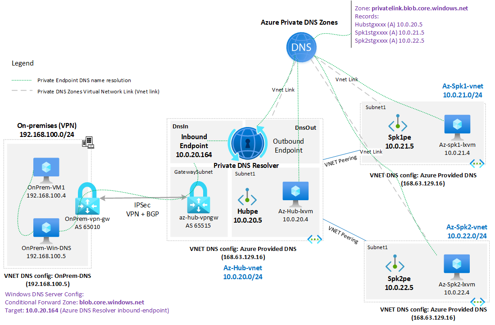
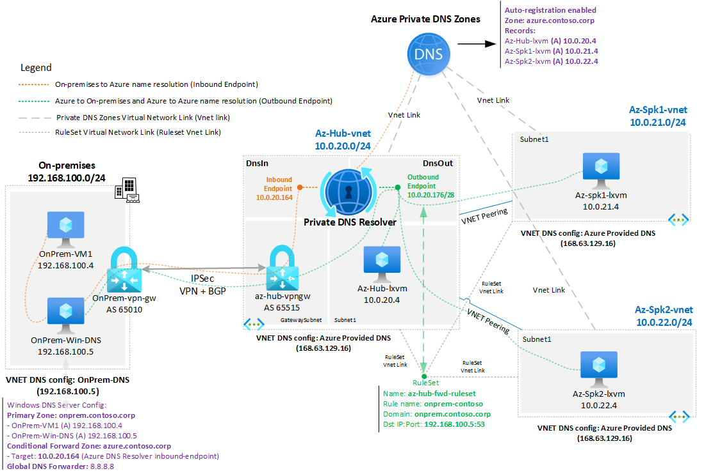
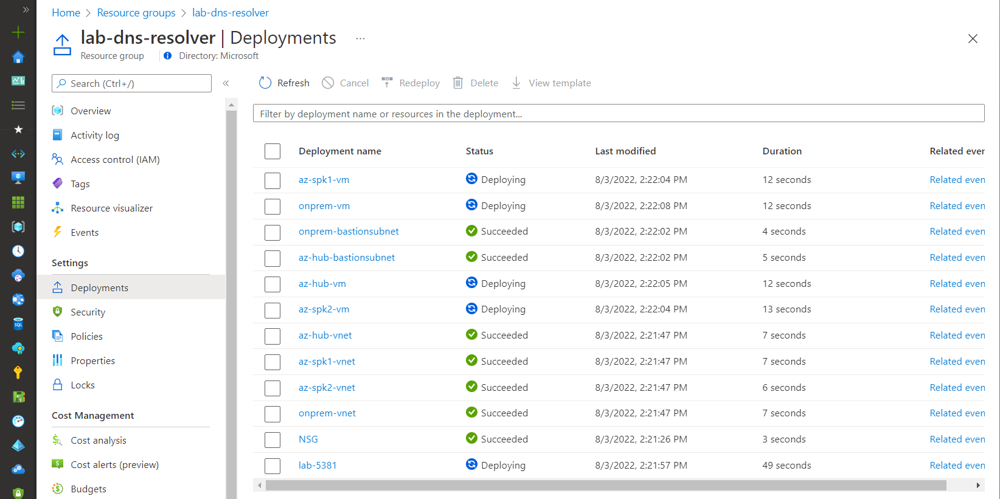

# Lab: Azure DNS Private Resolver (Hub and Spoke)

**Content**

[Intro](#intro)

[Lab diagram](#lab-diagram)
- [Scenario 1: Private endpoint DNS name resolution](#scenario-1-private-endpoint-dns-name-resolution)
- [Scenario 2: On-premises and Azure DNS integration](#scenario-2-on-premises-and-azure-dns-integration)

[Deploy this solution](#deploy-this-solution)

[Validation](#validation)
- [Scenario 1: Private endpoint DNS name resolution](#scenario-1-private-endpoint-dns-name-resolution-1)
- [Scenario 2: On-premises and Azure DNS integration](#scenario-2-on-premises-and-azure-dns-integration-1)

[Clean up](#clean-up)

## Intro

Azure DNS Private Resolver (Public Preview) is a new network component that facilitates DNS name resolution integration between On-premises to Azure and vice-versa. Please, review the official documentation for more information: [What is Azure DNS Private Resolver?](https://docs.microsoft.com/en-us/azure/dns/dns-private-resolver-overview)

The goal of this lab is to give you a ready environment where you can play or demo the Azure DNS Private Resolver over two scenarios. The first scenario is to demonstrate the integration with Azure Private Endpoint name resolution, by allowing the On-premises DNS Server to resolve Private Endpoint names hosted inside Azure Private DNS zones such as  **privatelink.blob.core.windows.net**. In the second scenario we have Azure and On-premises resolving each other's domain zones where **onprem.contoso.corp** is the On-premises hosted zone in Windows Server DNS Server and **azure.contoso.corp** is on the Azure Private DNS Zones.

## Lab diagram

### Scenario 1: Private endpoint DNS name resolution



### Scenario 2: On-premises and Azure DNS integration



### Lab components

The lab includes the following components:

**Azure side:**

- Azure Hub and two spokes virtual networks (VNETs) with their respective address spaces: 10.0.20.0/24 (Hub), 10.0.21.0/24 (Spoke1), and 10.0.22.0/24 (Spoke2)
- Linux VMs on each Azure VNETs accessible via Serial Console or Bastion.
- Each VNET has Private Endpoint towards their respective storage account.
- Azure VPN Gateway Active/Active using BGP (ASN 65515) with a S2S VPN connection to On-premises.
- Azure DNS Private Resolver with both inbound and outbound endpoints.
- There's a DNS Private Resolver Ruleset with a single rule to **onprem.constoso.corp** using on-prem Windows DNS Server as destination (192.168.100.5). That rule set has VNET links to each Azure VNET.
- Private DNS Zones host two zones: **azure.constoso.corp** with auto-registration to get all Azure VM names automatically registered) and privatelink.blob.core.windows.net hosting the three Private Endpoints for each VNET. 
- There are VNET links for both Zones hosted in Azure Private DNS Zones linked to facilitate VNET name resolution via Azure Provided DNS (168.63.129.16).

**On-premises side:**

- On-premises emulated VNET with address space: 192.168.100.0/24.
- VNET DNS configuration uses Windows DNS Server (192.168.100.5) for On-premises and Azure name resolution.
- There are two VMs. A Linux VM to emulate the client and a Windows Server DNS hosting **onprem.consotos.corp** zone.
- Windows DNS Server hosts **onprem.contoso.com**
- VPN Gateway Active/Passive using BGP (ASN 65010) with a S2S VPN connection to the Azure VPN Gateway.
- Bastion has been deployed to allow access to both Linux and Windows VMs. Linux VM can also be accessed using Serial Console.

**Note:** default username is azureuser and password Msft123Msft123. You can change that over parameters files before you deploy.

## Deploy this solution

The lab is also available in the above .azcli that you can rename as .sh (shell script) and execute. You can open [Azure Cloud Shell (Bash)](https://shell.azure.com) and run the following commands build the entire lab:

```bash
wget -O adr-deploy.sh https://raw.githubusercontent.com/dmauser/azure-dns-private-resolver/main/adr-lab/adr-deploy.azcli
chmod +xr adr-deploy.sh
./adr-deploy.sh 
```

**Note:** Azure Cloud Shell has a timeout of 20 min of inactivity. Please, ensure you have an active window or issue a few times enter on your keyboard during the deployment. An alternative for Azure Cloud Shell is to install AZCLI for your Linux distribution or get Linux for Windows via WSL2. See more information in [Set up a WSL development environment](https://docs.microsoft.com/en-us/windows/wsl/setup/environment)

You can follow the the first part of the provisioning by using Deployments under settings section over the resource group as shown:



The second part of the deployment which build On-premises DNS Server, DNS Private Resolver, Private Link and DNS configuration is done using CLI. Please, note that the whole provisioning process will take around 35 minutes to complete.

Another approach you can use is to deploy the lab step-by-step using the CLI commands below:

```Bash
# Pre-Requisites
az extension add -n dns-resolver

#Parameters
rg=lab-dns-resolver #Define your resource group
location=eastus #Set location
username=azureuser
password=Msft123Msft123
dnsvmname=onprem-windns

#Variables
mypip=$(curl -4 ifconfig.io -s) #Captures your local Public IP and adds it to NSG to restrict access to SSH only for your Public IP.
sharedkey=$(openssl rand -base64 24) #VPN Gateways S2S shared key is automatically generated. This works on Linux only.

#Define parameters for Azure Hub and Spokes:
AzurehubName=az-hub #Azure Hub Name
AzurehubaddressSpacePrefix=10.0.20.0/24 #Azure Hub VNET address space
AzurehubNamesubnetName=subnet1 #Azure Hub Subnet name where VM will be provisioned
Azurehubsubnet1Prefix=10.0.20.0/27 #Azure Hub Subnet address prefix
AzurehubgatewaySubnetPrefix=10.0.20.32/27 #Azure Hub Gateway Subnet address prefix
AzureFirewallPrefix=10.0.20.64/26 #Azure Firewall Prefix
AzurehubrssubnetPrefix=10.0.20.128/27 #Azure Hub Route Server subnet address prefix
AzureHubDnsInSubnetPrefix=10.0.20.160/28
AzureHubDnsOutSubnetPrefix=10.0.20.176/28
AzureHubBastionSubnet=10.0.20.192/26
Azurespoke1Name=az-spk1 #Azure Spoke 1 name
Azurespoke1AddressSpacePrefix=10.0.21.0/24 # Azure Spoke 1 VNET address space
Azurespoke1Subnet1Prefix=10.0.21.0/27 # Azure Spoke 1 Subnet1 address prefix
Azurespoke2Name=az-spk2 #Azure Spoke 1 name
Azurespoke2AddressSpacePrefix=10.0.22.0/24 # Azure Spoke 1 VNET address space
Azurespoke2Subnet1Prefix=10.0.22.0/27 # Azure Spoke 1 VNET address space

#On-premises 
#Define emulated On-premises parameters:
OnPremName=onprem #On-premises Name
OnPremVnetAddressSpace=192.168.100.0/24 #On-premises VNET address space
OnPremSubnet1prefix=192.168.100.0/27 #On-premises Subnet1 address prefix
OnPremgatewaySubnetPrefix=192.168.100.128/27 #On-premises Gateways address prefix
OnPremAzureBastionSubnet=192.168.100.192/26
OnPremgatewayASN=60010 #On-premises VPN Gateways ASN

#Parsing parameters above in Json format (do not change)
JsonAzure={\"hubName\":\"$AzurehubName\",\"addressSpacePrefix\":\"$AzurehubaddressSpacePrefix\",\"subnetName\":\"$AzurehubNamesubnetName\",\"subnet1Prefix\":\"$Azurehubsubnet1Prefix\",\"AzureFirewallPrefix\":\"$AzureFirewallPrefix\",\"gatewaySubnetPrefix\":\"$AzurehubgatewaySubnetPrefix\",\"rssubnetPrefix\":\"$AzurehubrssubnetPrefix\",\"bastionSubnetPrefix\":\"$AzureHubBastionSubnet\",\"spoke1Name\":\"$Azurespoke1Name\",\"spoke1AddressSpacePrefix\":\"$Azurespoke1AddressSpacePrefix\",\"spoke1Subnet1Prefix\":\"$Azurespoke1Subnet1Prefix\",\"spoke2Name\":\"$Azurespoke2Name\",\"spoke2AddressSpacePrefix\":\"$Azurespoke2AddressSpacePrefix\",\"spoke2Subnet1Prefix\":\"$Azurespoke2Subnet1Prefix\"}
JsonOnPrem={\"name\":\"$OnPremName\",\"addressSpacePrefix\":\"$OnPremVnetAddressSpace\",\"subnet1Prefix\":\"$OnPremSubnet1prefix\",\"gatewaySubnetPrefix\":\"$OnPremgatewaySubnetPrefix\",\"bastionSubnetPrefix\":\"$OnPremAzureBastionSubnet\",\"asn\":\"$OnPremgatewayASN\"}

#Deploy base lab environment = Hub + VPN Gateway + VM and two Spokes with one VM on each.
echo Deploying base lab: Hub with Spoke1 and 2, On-Premises and VPN using VNGs with BGP.
echo "*** It will take around 30 minutes to finish the deployment ***"
az group create --name $rg --location $location --output none
az deployment group create --name lab-$RANDOM --resource-group $rg \
--template-uri https://raw.githubusercontent.com/dmauser/azure-hub-spoke-base-lab/main/azuredeployv2.json \
--parameters deployHubVPNGateway=true deployOnpremisesVPNGateway=true enableBgp=true gatewaySku=VpnGw1 vpnGatewayGeneration=Generation1 Restrict_SSH_VM_AccessByPublicIP=$mypip sharedKey=$sharedkey deployHubERGateway=false Onprem=$JsonOnPrem Azure=$JsonAzure VmAdminUsername=$username VmAdminPassword=$password deployBastion=true \
--output none

#Creating Storage Accounta (boot diagnostics + serial console)
echo Creating Hub and Spokes storage accounts for serial console and private link.
randomIdentifier1=$RANDOM 
az storage account create -n hubstg$randomIdentifier1 -g $rg -l $location --sku Standard_LRS -o none
az storage account create -n spk1stg$randomIdentifier1 -g $rg -l $location --sku Standard_LRS -o none
az storage account create -n spk2stg$randomIdentifier1 -g $rg -l $location --sku Standard_LRS -o none

#Enabling boot diagnostics for all VMs in the resource group (Serial console)
echo Enabling boot diagnostics for all VMs in the resource group for serial console access
stguri1=$(az storage account show -n hubstg$randomIdentifier1 -g $rg --query primaryEndpoints.blob -o tsv)
az vm boot-diagnostics enable --storage $stguri1 --ids $(az vm list -g $rg --query '[?contains(location,`'$location'`)].{id:id}' -o tsv) -o none

### Installing tools for networking connectivity validation such as traceroute, tcptraceroute, iperf and others (check link below for more details) 
echo Installing tools for networking connectivity validation such as traceroute, tcptraceroute, iperf and others  
nettoolsuri="https://raw.githubusercontent.com/dmauser/azure-vm-net-tools/main/script/nettools.sh"
for vm in `az vm list -g $rg --query "[?storageProfile.imageReference.offer=='UbuntuServer'].name" -o tsv`
do
 az vm extension set \
 --resource-group $rg \
 --vm-name $vm \
 --name customScript \
 --publisher Microsoft.Azure.Extensions \
 --protected-settings "{\"fileUris\": [\"$nettoolsuri\"],\"commandToExecute\": \"./nettools.sh\"}" \
 --no-wait
done

# Deploying On-premises Windows DNS Server
echo Deploying On-premises Windows DNS Server
az network nic create --name $OnPremName-windns-nic --resource-group $rg --subnet subnet1 --vnet $OnPremName-vnet -o none
az vm create --resource-group $rg --location $location --name $OnPremName-windns --size Standard_DS1_v2 --nics $OnPremName-windns-nic  --image MicrosoftWindowsServer:WindowsServer:2019-Datacenter-smalldisk:latest --admin-username $username --admin-password $password -o none
az vm extension set --resource-group $rg --vm-name $OnPremName-windns  --name CustomScriptExtension \
 --publisher Microsoft.Compute \
 --setting "{\"commandToExecute\": \"powershell Install-WindowsFeature -Name DNS -IncludeManagementTools\"}" \
 --no-wait

# Deploying Azure DNS Private Resolver
echo Deploying Azure DNS Private Resolver
hubvnetid=$(az network vnet show -g $rg -n $AzurehubName-vnet --query id -o tsv)
az dns-resolver create --name $AzurehubName-dnsresolver -g $rg --location $location --id $hubvnetid -o none

# Creating DNS inbound-endpoint 
echo Creating DNS inbound-endpoint
az network vnet subnet create -g $rg --vnet-name $AzurehubName-vnet -n dnsin --address-prefixes $AzureHubDnsInSubnetPrefix --output none
indnsid=$(az network vnet subnet show -g $rg -n dnsin --vnet-name $AzurehubName-vnet --query id -o tsv)
az dns-resolver inbound-endpoint create -g $rg --name InboundEndpoint \
 --dns-resolver-name $AzurehubName-dnsresolver \
 --location $location \
 --ip-configurations private-ip-address="" private-ip-allocation-method="Dynamic" id="$indnsid"

# Creating DNS outbound-endpoint 
echo Creating DNS outbound-endpoint 
az network vnet subnet create -g $rg --vnet-name $AzurehubName-vnet -n dnsout --address-prefixes $AzureHubDnsOutSubnetPrefix --output none
outdnsid=$(az network vnet subnet show -g $rg -n dnsout --vnet-name $AzurehubName-vnet --query id -o tsv)
az dns-resolver outbound-endpoint create -g $rg --name OutboundEndpoint \
 --dns-resolver-name $AzurehubName-dnsresolver \
 --location $location \
 --id="$outdnsid" \
 --output none

# Creating forwarding-ruleset
echo Creating forwarding-ruleset 
outepid=$(az dns-resolver outbound-endpoint show -g $rg --name OutboundEndpoint --dns-resolver-name $AzurehubName-dnsresolver --query id -o tsv)
az dns-resolver forwarding-ruleset create -g $rg --name $AzurehubName-fwd-ruleset \
 --location $location \
 --outbound-endpoints id=$outepid \
 --output none

# Creating forwarding-rule to allow Azure to On-premises DNS name resolution integration
echo Creating forwarding-rule to allow Azure to On-premises DNS name resolution integration
dnsvmip=$(az network nic show --name $dnsvmname-nic -g $rg  --query "ipConfigurations[0].privateIpAddress" -o tsv)
az dns-resolver forwarding-rule create -g $rg --name onprem-contoso \
 --ruleset-name $AzurehubName-fwd-ruleset \
 --domain-name "onprem.contoso.corp." \
 --forwarding-rule-state "Enabled" \
 --target-dns-servers ip-address="$dnsvmip" port=53 \
 --output none

# Creating ruleset vnet link for Hub vnet
echo Creating ruleset vnet link for Hub vnet
az dns-resolver vnet-link create -g $rg --name $AzurehubName-vnetlink \
 --ruleset-name $AzurehubName-fwd-ruleset \
 --id $(az network vnet show -g $rg -n $AzurehubName-vnet --query id -o tsv) \
 --output none

# Creating ruleset vnet link for Spoke1 vnet
echo Creating ruleset vnet link for Spoke1 vnet
az dns-resolver vnet-link create -g $rg --name $Azurespoke1Name-vnetlink \
 --ruleset-name $AzurehubName-fwd-ruleset \
 --id $(az network vnet show -g $rg -n $Azurespoke1Name-vnet --query id -o tsv) \
 --output none

# Creating ruleset vnet link for Spoke2 vnet
echo Creating ruleset vnet link for Spoke2 vnet
az dns-resolver vnet-link create -g $rg --name $Azurespoke2Name-vnetlink \
 --ruleset-name $AzurehubName-fwd-ruleset \
 --id $(az network vnet show -g $rg -n $Azurespoke2Name-vnet --query id -o tsv) \
 --output none

# ***** Private Endpoint + PrivateLink Private DNZ Zone ****
echo Creating Private Endpoint and PrivateLink Private DNZ Zone integration
# Creating DNS Private Link zone: privatelink.blob.core.windows.net
echo Creating DNS Private Link zone: privatelink.blob.core.windows.net
az network private-dns zone create \
 --resource-group $rg \
 --name "privatelink.blob.core.windows.net" \
 --output none

# Creating Private Endpoints for Hub, Spoke1 and Spoke 2.
echo Creating Private Endpoints for Hub, Spoke1 and Spoke 2.
## Hub
stgname=$(az storage account list -g $rg --query '[?contains(name,`'hub'`)].{name:name}' -o tsv)
az network private-endpoint create \
    --connection-name $AzurehubName-connection \
    --name hubpe \
    --private-connection-resource-id $(az storage account show -g $rg -n $stgname --query id -o tsv) \
    --resource-group $rg \
    --subnet subnet1 \
    --group-id blob \
    --vnet-name $AzurehubName-vnet \
    --output none

## Spk1
stgname=$(az storage account list -g $rg --query '[?contains(name,`'spk1'`)].{name:name}' -o tsv)
az network private-endpoint create \
    --connection-name $Azurespoke1Name-connection \
    --name spk1pe \
    --private-connection-resource-id $(az storage account show -g $rg -n $stgname --query id -o tsv) \
    --resource-group $rg \
    --subnet subnet1 \
    --group-id blob \
    --vnet-name $Azurespoke1Name-vnet \
    --output none
## Spk2
stgname=$(az storage account list -g $rg --query '[?contains(name,`'spk2'`)].{name:name}' -o tsv)
az network private-endpoint create \
    --connection-name $Azurespoke2Name-connection \
    --name spk2pe \
    --private-connection-resource-id $(az storage account show -g $rg -n $stgname --query id -o tsv) \
    --resource-group $rg \
    --subnet subnet1 \
    --group-id blob \
    --vnet-name $Azurespoke2Name-vnet \
    --output none

#Creating Private DNS vnet link to Hub, Spoke1 and Spoke 2 vnets
echo Creating Private DNS vnet link to Hub, Spoke1 and Spoke 2 vnets
for vnet in $(az network vnet list -g $rg --query '[?contains(name,`'az'`)].{name:name}' -o tsv)
do
 az network private-dns link vnet create \
    --resource-group $rg \
    --zone-name "privatelink.blob.core.windows.net" \
    --name $vnet-link \
    --virtual-network $vnet \
    --registration-enabled false \
    --output none
done

# Creating DNS zone group to have PE registered in Private Link DNS zone.
echo Creating DNS zone group to have PE registered in Private Link DNS zone.
for pe in $(az network private-endpoint list -g $rg --query [].name -o tsv)
do
az network private-endpoint dns-zone-group create \
    --resource-group $rg \
    --endpoint-name $pe \
    --name privatelink_blob_core_windows_net \
    --private-dns-zone "privatelink.blob.core.windows.net" \
    --zone-name default \
    --output none
done

# ***** On-premises (onprem.contoso.corp) + Azure (azure.contoso.corp) DNS integration ***** 
echo -e "***** On-premises domain onprem.contoso.corp + Azure domain azure.contoso.corp DNS integration *****" 

# Creating Private DNS Zone for Azure VM resolution
echo Creating Private DNS Zone azure.contoso.corp for Azure VM resolution
az network private-dns zone create -g $rg -n azure.contoso.corp --output none

# Linking hub for DNS name resgistration (Private DNZ zone: azure.contoso.corp)
echo Linking hub for DNS name resgistration Private DNZ zone: azure.contoso.corp
az network private-dns link vnet create -g $rg -n $AzurehubName-link -z azure.contoso.corp -v $AzurehubName-vnet -e true -o none

# Linking all spokes for registration (Private DNZ zone: azure.contoso.corp)
echo Linking all spokes for registration Private DNZ zone: azure.contoso.corp
for spoke in $(az network vnet list -g $rg --query '[?contains(name,`'az-spk'`)].{name:name}' -o tsv)
do
 echo Adding Private DNS vnet link to $spoke
 az network private-dns link vnet create -g $rg -n $spoke-link -z azure.contoso.corp -v $spoke -e true -o none
done

#***** Configuring On-Premises DNS *****
echo Configuring On-premises DNS Server
# Run command for Onprem DNS configuration:
dnsresolverip=$(az dns-resolver inbound-endpoint show -g $rg --dns-resolver-name $AzurehubName-dnsresolver --name InboundEndpoint --query ipConfigurations[].privateIpAddress -o tsv)
# fwdnsresolverip=$(az network firewall show --name $hubname-azfw --resource-group $rg --query "hubIpAddresses.privateIpAddress" -o tsv)
globaldnsfwd=8.8.8.8 # Global/Server level DNS Forwarder
onpremvmip=$(az network nic show --name onprem-lxvm-nic -g $rg  --query "ipConfigurations[0].privateIpAddress" -o tsv)
az vm run-command invoke --command-id RunPowerShellScript \
 --name $dnsvmname \
 --resource-group $rg \
 --scripts 'param([string]$arg1,[string]$arg2,[string]$arg3,[string]$arg4,[string]$arg5)' \
 'Set-DnsServerForwarder -IPAddress $arg2' \
 'Add-DnsServerConditionalForwarderZone -Name "blob.core.windows.net" -MasterServers $arg1 -PassThru' \
 'Add-DnsServerConditionalForwarderZone -Name "azure.contoso.corp" -MasterServers $arg1 -PassThru' \
 'Add-DnsServerPrimaryZone -Name "onprem.contoso.corp" -ZoneFile "onprem.contoso.corp.dns"' \
 'Add-DnsServerResourceRecordA -Name "onprem-lxvm" -IPv4Address $arg3 -ZoneName "onprem.contoso.corp"' \
 'Add-DnsServerResourceRecordA -Name $arg4 -IPv4Address $arg5 -ZoneName "onprem.contoso.corp"' \
 --parameters $(echo "arg1="$dnsresolverip"" "arg2=$globaldnsfwd" "arg3=$onpremvmip" "arg4=$dnsvmname" "arg5=$dnsvmip") \
 --output none

# ***** Preparing On-premises VMs for Name Resolution *****
echo ***** Preparing On-premises VMs for Name Resolution *****
# Setting On-prem vnet to use On-Prem DNS Server
echo Setting On-prem vnet to use On-Prem DNS Server
az network vnet update -g $rg -n onprem-vnet \
 --dns-servers $(az network nic show --name $dnsvmname-nic -g $rg  --query "ipConfigurations[0].privateIpAddress" -o tsv) \
 --output none
# Restarting onprem VMs to commit the new VNET DNS settings.
echo Restarting onprem VMs to commit the new VNET DNS settings.
az vm restart --ids $(az vm list -g $rg --query '[?contains(name,`'onprem'`)].{id:id}' -o tsv) --no- --output none
echo Follow the validation script to test the name resolution.
echo Lab deployment has finished.
```

## Validation

### Scenario 1: Private endpoint DNS name resolution

```Bash
### Scenario 1: Private Endpoint DNS Name Resolution

# 1) List Blob Storage Account names to test Private Endpoint name resolution.
az storage account list -g $rg --query [].primaryEndpoints.blob -o tsv
# Example of the ouput for the hub storage account: https://hubstg32476.blob.core.windows.net/

# 2) Access VM Onprem-vmlx via serial console/SSH or Bastion 
## 2.1) Review DNS client config. It will show the DNS server configured.
systemd-resolve --status | grep "DNS Servers:"
## 2.2) Test storage account name resolution (change the name below based on the output on step 1):
nslookup hubstg32476.blob.core.windows.net
## Repeat the same steps above on spk1stgxxxx and spoke2stgxxx storage accounts.
## Test from all VMs (on-premises and Azure Hub and spokes)
## Expectation is to get the private endpoint IP for each

# 3) Access onprem-win-dns VM via Bastion and review the Windows DNS Configuration and the Conditional Forwarder zone (use Bastion to access the Windows VM).

# 4) Review the Private DNS Resolver configuration and inbound endpoints.

# 5) Review the private endpoints hubpe, spk1pe, and spk2pe configuration.

# 6) Review the Private DNS Zones configuration related to Private Link zone: privatelink.blob.core.windows.net
## Review VNET links from Hub, Spoke1 and Spoke2.
```

### Scenario 2: On-premises and Azure DNS integration

```Bash
### Scenario 2: On-premises and Azure DNS integration

# 1) Access onprem-win-dns VM via Bastion and review the Windows DNS Configuration. Check onprem.contoso.corp zone and its local DNS records.
# 2) Review the Azure DNS Resolver outbound endpoint as well as RuleSet with the specific rule to onprem.contoso.corp.
# 3) Test the name resolution from both sides by accessing onprem-lxvm via Bastion or Serial Console and issue a few nslookups against Azure VM names (az-hub-lxvm, az-spk1-lxvm, az-spk2-lxvm) using domain name azure.contoso.corp.
# For example:
# From onprem-lxvm run: 
nslookup az-hub-lxvm.azure.contoso.corp # repeat the same command for the other Azure VMs.
# From az-hub-lxvm or other Azure spoke VM run:
nslookup onprem-lxvm.onprem.contoso.corp 
nslookup onprem-windns.onprem.contoso.corp
# Name resolution should work from On-premises to Azure and vice-versa.
```

## Clean up

Delete the resource group via Portal or by running the following command:

```Bash
rg=lab-dns-resolver 
az group delete -g $rg --no-wait --yes
```